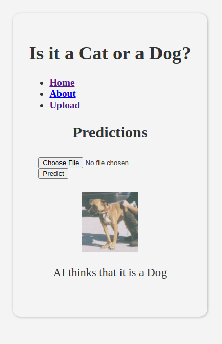

[Go To Heroku Instance](https://chaudha4-cat-or-dog.herokuapp.com/)

[](https://mybinder.org/v2/gh/chaudha4/ML-Classify-Cats-Dogs/master)


# Machine Learning with Python - Cat and Dog Image Classifier

This Project uses TensorFlow 2.0 and Keras to create a convolutional neural network that correctly classifies images of cats and dogs with 96% accuracy.

A running instance is deployed at https://chaudha4-cat-or-dog.herokuapp.com/

You can also launch the notebook at https://mybinder.org/v2/gh/chaudha4/ML-Classify-Cats-Dogs/master

## Model Summary

The model is built on top of a pre-trained MobileNetV2 model as the feature detector. MobileNetV2 is the second iteration of MobileNet released by Google with the goal of being smaller and more lightweight than models like ResNet and Inception.

### cat_dog_image_classifier-96percent_accuracy.ipynb
[](https://colab.research.google.com/github/chaudha4/ML-Classify-Cats-Dogs/blob/master/cat_dog_image_classifier-96percent_accuracy.ipynb)

### cat_dog_image_classifier-65percent_accuracy.ipynb
[](https://colab.research.google.com/github/chaudha4/ML-Classify-Cats-Dogs/blob/master/cat_dog_image_classifier-65percent_accuracy.ipynb)

### index.ipynb
[](https://colab.research.google.com/github/chaudha4/ML-Classify-Cats-Dogs/blob/master/index.ipynb)

# Python environment (Build Locally)
First, clone the repo. Set up git etc.

## Check what is already installed
Use `pip3 list` to see a list of installed packages.

## Install pip-tools
Before you can use `pip-compile`, you need to make sure that `pip-tools` is installed.

```
pip3 install pip-tools

```
## Generate requirements.txt

[pip-compile](https://github.com/jazzband/pip-tools/) is a handy
tool for combining loosely specified dependencies with a fully frozen environment.
You write a requirements.in with just the dependencies you need
and pip-compile will generate a requirements.txt with all the strict packages and versions that would come from installing that package right now.
That way, you only need to specify what you actually know you need,
but you also get a snapshot of your environment.

```
pip-compile
```
After you run `pip-compile`, your requirements.txt should be updated and is ready for use.

## Install packages
The `requirements.txt` file should list all Python libraries that your notebooks depend on, and they will be installed using:

```
pip3 install -r requirements.txt
```

The base Binder image contains no extra dependencies, so be as
explicit as possible in defining the packages that you need. This includes
specifying explicit versions wherever possible.

If you do specify strict versions, it is important to do so for *all*
your dependencies, not just direct dependencies.
Strictly specifying only some dependencies is a recipe for environments
breaking over time.

## Run the web service.
For testing purpose, you can use the built-in flask web server. Just run the main program `app.py` from command line and it should launch the service. The output would look similar to this
```
 * Serving Flask app "app" (lazy loading)
 * Environment: production
   WARNING: This is a development server. Do not use it in a production deployment.
   Use a production WSGI server instead.
 * Debug mode: on
 * Running on http://127.0.0.1:5000/ (Press CTRL+C to quit)
 ```

# Heroku Deployment
Heroku relies on `Procfile` to start the service. We use Web Server Gateway Interface (WSGI) server called Green Unicorn, commonly shortened to "Gunicorn" for production deployment.

## Heroku Local Env testing
To locally start all of the process types that are defined in Procfile use `heroku local`

To locally start a particular process type, specify the process type. For example, “web” or “worker”:
```
heroku local web
```

## Heroku Production deployment
View logs on a deployed instance.
```
heroku logs -n 200 --app chaudha4-cat-or-dog
```
View logs realtime on deployed instance.
```
heroku logs --tail --app chaudha4-cat-or-dog
```
On Browser, you can access logs here - 
https://dashboard.heroku.com/apps/chaudha4-cat-or-dog/logs



# Useful links
https://towardsdatascience.com/easy-image-classification-with-tensorflow-2-0-f734fee52d13
https://www.kdnuggets.com/2020/05/build-deploy-machine-learning-web-app.html
